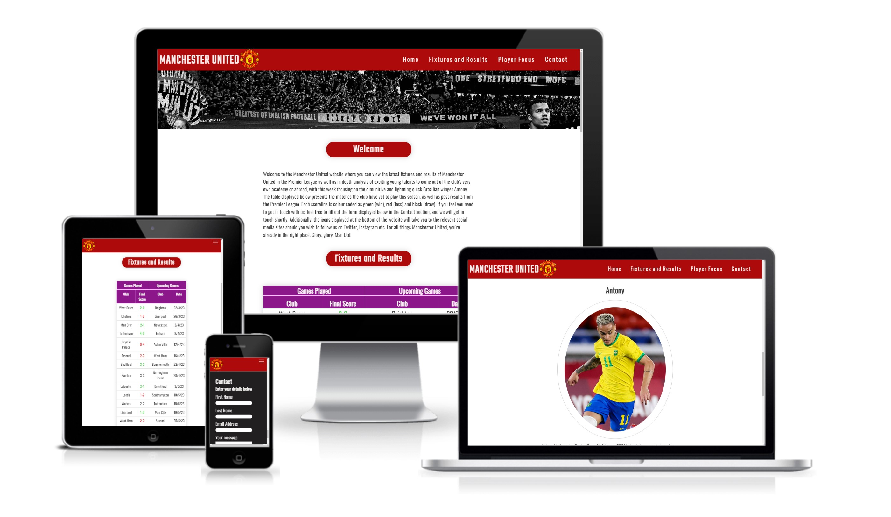

# Manchester United 

Welcome to my Manchester United Fan site. This site contains all things Manchester United from player information to upcoming fixtures in the current Premier League season. This site informs users of the latest happenings around the club, and also gives an insight on the brightest young talents from within the club.

## Goals and objectives

The ultimate goal and objective for my site is to entice and appeal to Manchester United fans to engage with the website through it's professional and attractive presentation. Therefore, it was critical for me to ensure that the overall layout of my website looked appealing as well as user-friendly. That means that the information presented is displayed both clearly and objectively in a way that is easy to digest.

Another goal for my website is to inform users and fans of the latest upcoming games that the club have yet to play in the season, giving the specigfic date of each fixture in a clearly organised tabular format. This is so that users know exactly what game the club are going to play next and when, so that they can make plans to watch the game beforehand. It also informs users of the games the club have already played in a colour coded format so it is easy and clear to read. This tells fans of how the club is currently performing in the season in a clear format.

## Table of contents

* [UX](#ux)
* [User Stories](#user-stories)
* [Site owners objectives](#site-owners-objectives)
* [Requirements](#requirements)
* [Expectations](#expectations)
* [Design Choices](#design-choices)
    + [Fonts](#fonts)
    + [Icons](#icons)
    + [Colours](#colours)
    + [Structure](#structure)
* [Features](#features)
    + [Existing Features](#existing-features)
      - [**Header and logo**](#--header-and-logo--)
      - [**Navigation Bar**](#--navigation-bar--)
      - [**Desktop (min-width: …..px)**](#--desktop--min-width---px---)
      - [**Small screens (min-width: …..px)**](#--small-screens--min-width---px---)
  * [Sections](#sections)
    + [**Home section**](#--home-section--)
    + [**Fixtures and Results**](#--fixtures-and-results--)
    + [**Player Focus**](#--player-focus--)
    + [**Contact**](#--contact--)
    + [**Footer**](#--footer--)
  * [Technologies Used](#technologies-used)
    + [Languages](#languages)
    + [Libraries & Framework](#libraries---framework)
    + [Tools](#tools)

### UX

* Visually attractive to users
* Easy and clear to read and view information
* Consistent with the colours and theme of the club
* Very easy for users to navigate around with clear links
* The information provided is both relevant and useful

### User Stories

*	Users want the latest information regarding the club
*	Users want the UI to be smooth and responsive
*	Users want to be able to navigate through the site easily and efficiently
*	Users want interesting new insights into the club they may not have been aware of before
*	Users want a deeper connection with the club
*	Users want information regarding upcoming fixtures
*	Users want information regarding the club’s brightest young talents

### Site owners objectives

*	Promote the club
*	Supply fans with valuable knowledge and insight into the club
*	Increase rankings on search engines

### Requirements

* Maintains structure of website on different screen sizes
* Information provided is clear and concise to the user
* Deepen the connection between the fan and the club through the content within the site
* Entice users who are not fans of the club with visually appealing structure
* Retain the user’s attention

### Expectations

* I expect for the colour scheme to match the club’s official colours
* I expect a level of consistency in the design of my site throughout all my sections
* I expect all of my links (external and internal) to work as intended
* I expect the structural integrity of my site to remain on smaller screens
* I expect all links to social media sites to be opened in a new tab
* I expect the information provided to be both accurate and relevant to the club

## Design Choices

### Fonts

My main choice of font styles that I have decided to go with are Google Fonts. The reason why I have chosen this is due to the large library of professional font styles that I have access to for my website, as well as being able to combine and preview how different fonts would look when placed together as headings and paragraphs.

### Icons
I have also decided to implement icons within my website in order to make it seem more visually and aesthetically appealing to the user. This will add a little variety to the content of my site so the user is not overwhelmed with too much text and information, which may cause them to leave. These icons will be suitably styled in order to remain consistent with the style of the entire site. Icons will also be used for social media links. The icons I have decided to use are from Font Awesome.

### Colours
As my website is based on Manchester United, a real football club, it was important that my website contained a colour scheme that would match the club’s official colours, which is predominantly red, white and black. When users enter the site, they should have no doubt in their mind that they are in a website dedicated to Manchester United due to the colour scheme used throughout the site.

Therefore I have decided to use the three main colours of the club, red, white and black throughout my website consistently. This is so that it matches the club that it represents accurately and aesthetically. 

<u>**Red**</u>- This will be used as the banner at the top of each section as it is the primary colour of the club

<u>**White**</u>- This colour will used for Headings and text on a red background in order to make it clear and easy to read for the user

<u>**Black**</u>- This colour will be used for the main body of text on a normal white background

### Structure
It is vital that the structure of my website has a level of consistency within it when presented to the user. Every professional website has a structural consistency that is evident throughout each section. The main body and content of each section may be different, but the overall and underlying structure of the site such as the placement of banners and the navigation bar must remain the same. This will make my website seem more appealing and professional to the user, and give the impression of a sophisticated site.

The structure that I have decided to go with is the name of the club, Manchester United displayed on the top left hand corner along with the badge. The navigation bar is displayed on the opposite side at the top of each section to retain that consistency throughout. I have then decided to include a banner with an appropriate image below the nav bar that has a zoom in and out effect applied. These elements are consistent throughout my whole website regardless of the content shown below them.

## Features

### Existing Features

#### **Header and logo**
The first element which I have decided to include is my main header, which is the club’s name Manchester United. The font I have decided to go with is Teko, as it is both appropriate and professional. I have also decided to include the official logo of the club as it reinforces the title of the site and provides an official look and feeling to the section.

#### **Navigation Bar**
The navigation bar is displayed at the top right, and consists of the home section, Fixtures and Results, Players and Contact section. It was important that my navigation bar is responsive, easy to use and works as intended across multiple devices regardless of the screen size. I have also styled each link appropriately so that they are underlined each time the user hovers over a link in order to increase visibility and clarity on which section they will enter once selected.

#### **Desktop (min-width: …..px)**
On a normal desktop screen, the navigation bar is displayed as intended on the top right hand side of the screen, with all of the links visible to the user

#### **Small screens (min-width: …..px)**
As the navigation bar would not be clearly visible to the user, it takes on a hamburger style on smaller screens such as mobile devices.
When selected by the user, it redirects the user to a main menu which consists of each navigational link to each section of my website. This was done in order to make it easier for users using a mobile device to navigate through my website without compromising the structural integrity and squeezing my navigational bar, which would make my site look cramped and unprofessional.

## Sections

### **Home section**
The home section consists of the banner shown below:

The banner is both relevant and grabs the user’s attention. It clearly tells the user it is a Manchester United website. It also includes a zoom in and out animation in order to make the website seem more fun and interactive.

Below the banner is a Welcome section which details what the website is and what the user can expect to find within it. It is a brief and useful introduction of my website which users will find helpful once they enter the site.

### **Fixtures and Results**
This section includes information regarding the upcoming fixtures of Manchester United, as well as their recent results in previous games played in a tabular format. The reason why I have decided to include this is so that users are informed about how the club has performed recently in their last run of matches in a clear and structured way that makes it easy for users to view and understand without any confusion. The table that I have included also includes a colour code where every result which the club has won is displayed in green, while every loss is displayed in red.

### **Player Focus**
This is a section dedicated to one player from Manchester United. This includes a brief analysis of the way the player performs in a game as well as their key strengths and weaknesses that make them unique from the rest of the team. The reason why I have decided to include this section is to give the user a sense of connection to the club through it’s most exciting players, as well as retain their attention and engagement in the site. 

### **Contact**
The Contact section contains a form where the user enters their personal details such as their name and email address if they wish to get in touch with the provider. 

### **Footer**
The footer contains social media icons that redirects the user to the official social media site such as Facebook or Twitter.

## Technologies Used

### Languages
*	HTML
*	CSS
### Libraries & Framework
*	Google Fonts
*	Font Awesome library
### Tools
*	Gitpod
*	Balsamic
*	W3C HTML Validation Service
*	W3C CSS Validation Service
*	Bootstrap
*	Colourmind
*	Font Awesome library
*	Google Fonts
*	Unsplash
*	Box Shadow Generator

