# Manchester United 

Welcome to my Manchester United Fan site. This site contains all things Manchester United from player information to upcoming fixtures in the current Premier League season. This site informs users of the latest happenings around the club, and also gives an insight on the brightest young talents from within the club.

## Goals and objectives

The ultimate goal and objective for my site is to entice and appeal to Manchester United fans to engage with the website through it's professional and attractive presentation. Therefore, it was critical for me to ensure that the overall layout of my website looked appealing as well as user-friendly. That means that the information presented is displayed both clearly and objectively in a way that is easy to digest.

Another goal for my website is to inform users and fans of the latest upcoming games that the club have yet to play in the season, giving the specigfic date of each fixture in a clearly organised tabular format. This is so that users know exactly what game the club are going to play next and when, so that they can make plans to watch the game beforehand. It also informs users of the games the club have already played in a colour coded format so it is easy and clear to read. This tells fans of how the club is currently performing in the season in a clear format.

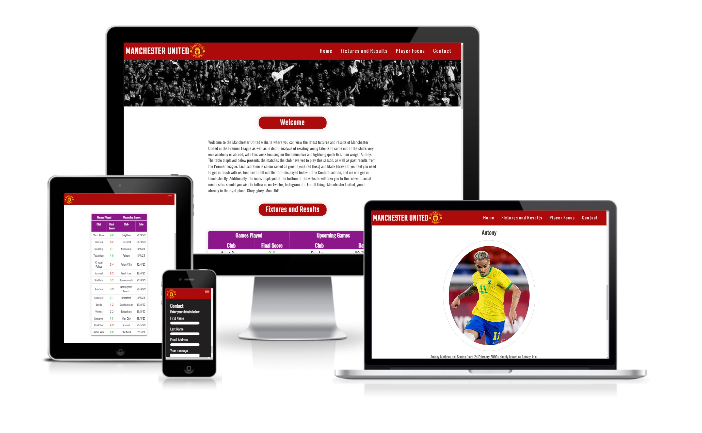

## Table of contents

* [**UX**](#ux)
* [**User Stories**](#user-stories)
* [**Site owners objectives**](#site-owners-objectives)
* [**Requirements**](#requirements)
* [**Expectations**](#expectations)
* [**Design Choices**](#design-choices)
    + [Fonts](#fonts)
    + [Icons](#icons)
    + [Colours](#colours)
    + [Structure](#structure)
* [**Features**](#features)
    + [Existing Features](#existing-features)
      - [Header and logo](#header-and-logo)
      - [Navigation Bar](#navigation-bar)
      - [Desktop](#desktop)
      - [Small screens](#small-screens)
* [**Sections**](#sections)
    + [Home section](#home-section)
    + [Fixtures and Results](#fixtures-and-results)
    + [Player Focus](#player-focus)
    + [Contact](#contact)
    + [Footer](#footer)
* [**Technologies Used**](#technologies-used)
    + [Languages](#languages)
    + [Libraries & Framework](#libraries-and-framework)
    + [Tools](#tools)

### UX

* Visually attractive to users
* Easy and clear to read and view information
* Consistent with the colours and theme of the club
* Very easy for users to navigate around with clear links
* The information provided is both relevant and useful

### User Stories

*	Users want the latest information regarding the club
*	Users want the UI to be smooth and responsive
*	Users want to be able to navigate through the site easily and efficiently
*	Users want interesting new insights into the club they may not have been aware of before
*	Users want a deeper connection with the club
*	Users want information regarding upcoming fixtures
*	Users want information regarding the club’s brightest young talents

### Site owners objectives

*	Promote the club
*	Supply fans with valuable knowledge and insight into the club
*	Increase rankings on search engines

### Requirements

* Maintains structure of website on different screen sizes
* Information provided is clear and concise to the user
* Deepen the connection between the fan and the club through the content within the site
* Entice users who are not fans of the club with visually appealing structure
* Retain the user’s attention

### Expectations

* I expect for the colour scheme to match the club’s official colours
* I expect a level of consistency in the design of my site throughout all my sections
* I expect all of my links (external and internal) to work as intended
* I expect the structural integrity of my site to remain on smaller screens
* I expect all links to social media sites to be opened in a new tab
* I expect the information provided to be both accurate and relevant to the club

[Back to top](#table-of-contents)

## Design Choices

### Fonts

My main choice of font styles that I have decided to go with are Oswald and Teko. These particular fonts have been carefully and meticulously selected as they are most relevent to my website and it's subject matter. I have selected these fonts from Google Fonts due to the large library of professional font styles that I have access to for my website, as well as being able to combine and preview how different fonts would look when placed together as headings and paragraphs.

### Icons
I have also decided to implement icons within my website in order to make it seem more visually and aesthetically appealing to the user. This will add a little variety to the content of my site so the user is not overwhelmed with too much text and information, which may cause them to leave. These icons will be suitably styled in order to remain consistent with the style of the entire site. The icons that I have utilised are for social media links that redirect the user to the relevent site such as Facebook, Instagram etc. These icons which I have decided to include within my site are taken from Font Awesome as they are both professional and free.

### Colours
As my website is based on Manchester United, a real football club, it was important that my website contained a colour scheme that would match the club’s official colours, which is predominantly red, white and black. When users enter the site, they should have no doubt in their mind that they are in a website dedicated to Manchester United due to the colour scheme used throughout the site.

Therefore I have decided to use the three main colours of the club, red, white and black throughout my website consistently. This is so that it matches the club that it represents accurately and aesthetically. 

<u>**rgb(173, 11, 11)**</u>- This will be used as the banner at the top of each section as it is the primary colour of the club

<u>**rgba(247, 245, 243, 0.97)**</u>- This colour will used for Headings and text on a red background in order to make it clear and easy to read for the user

<u>**#211f1f**</u>- This colour will be used for the main body of text on a normal white background, as well as the background for my contact section.

### Structure
It is vital that the structure of my website has a level of consistency within it when presented to the user. Every professional website has a structural consistency that is evident throughout each section. The main body and content of each section may be different, but the overall and underlying structure of the site such as the placement of banners and the navigation bar must remain the same. This will make my website seem more appealing and professional to the user, and give the impression of a sophisticated site.

The structure that I have decided to go with is the name of the club, Manchester United displayed on the top left hand corner along with the badge. The navigation bar is displayed on the opposite side at the top of each section to retain that consistency throughout. I have then decided to include a banner with an appropriate image below the nav bar that has a zoom in and out effect applied. These elements are consistent throughout my whole website regardless of the content shown below them.

[Back to top](#table-of-contents)

## Features

### Existing Features

#### **Header and logo**
The first element which I have decided to include is my main header, which is the club’s name Manchester United. The font I have decided to go with is Teko, as it is both appropriate and professional. I have also decided to include the official logo of the club as it reinforces the title of the site and provides an official look and feeling to the section. Both my header and logo are fixed to the navigation bar which users will always see and have access to at the top of the page as they scroll through the different sections of my website 

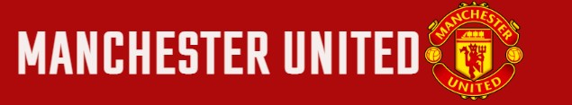

#### **Navigation Bar**
The navigation bar is displayed at the top right, and consists of the home section, Fixtures and Results, Player Focus and Contact section. It was important that my navigation bar is responsive, easy to use and works as intended across multiple devices regardless of the screen size. I have also styled each link appropriately so that they are underlined each time the user hovers over a link in order to increase visibility and clarity on which section they will enter once selected.

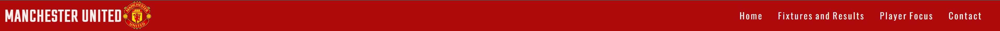

#### **Desktop**
On a normal desktop screen, the navigation bar is displayed as intended on the top right hand side of the screen, with all of the links visible to the user. The first image displayed at the top of this document shows what my website looks like on all screen sizes, which demonstrates my website is responsive to the smallest of screens such as mobile devices, to the largest desktops.

#### **Small screens**
As the navigation bar would not be clearly visible to the user, it takes on a hamburger style on smaller screens such as mobile devices. Once selected by the user, it opens up a navigation slide which contains a link to every section header of my website and named appropriately. This slide can be shown below:

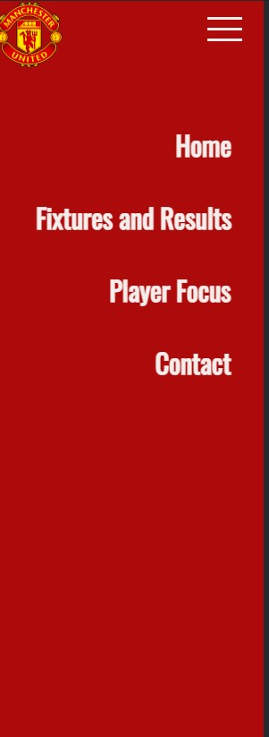

This is what the user sees once they have clicked on the menu icon at the top right hand side of the screen. Once they select a particular link, however, that specific link displays a black background in order to inform the user which section of the website they are currently in, as shown below:

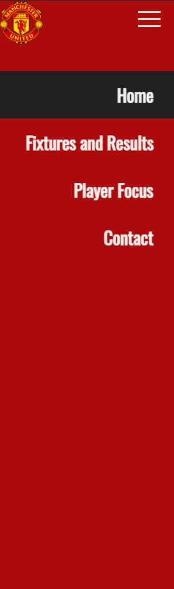

After the user selects a section of the site they wish to navigate to, they are directed smoothly to that particular section with the header displayed clearly at the top of the page. This was done in order to make it easier for users using a mobile device to navigate through my website without compromising the structural integrity and squeezing my navigational bar, which would make my site look cramped and unprofessional.

[Back to top](#table-of-contents)

## Sections

### **Home section**
The home section consists of the banner shown below:

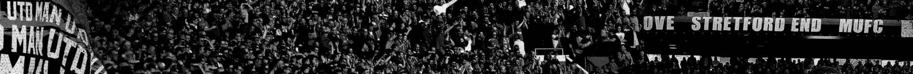

The banner is both relevant and grabs the user’s attention. It clearly tells the user it is a Manchester United website, and fills in the space underneath my header and nav bar that would otherwise have remained empty. This improves the overall look and feel of my website, and adds to it's professionalism.

Below the banner is a Welcome section which details what the website is and what the user can expect to find within it. It is a brief and useful introduction of my website which users will find helpful once they enter the site. It provides the user with a quick summary of each section of my website, as well as explains the colour coding system that I have implemented in my table shown in the "Fixtures and Results" section. This section can be seen below:

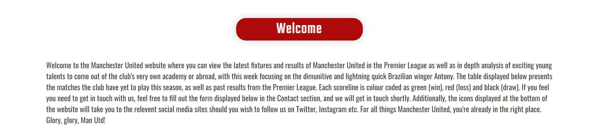

### **Fixtures and Results**
This section includes information regarding the upcoming fixtures of Manchester United, as well as their recent results in previous games played in a tabular format. The reason why I have decided to include this is so that users are informed about how the club has performed recently in their last run of matches in a clear and structured way that makes it easy for users to view and understand without any confusion. The table that I have included also includes a colour coded system where every result which the club has won is displayed in green, each loss is displayed in red and matches which they have drawn are in black. This table can be seen on the image below:

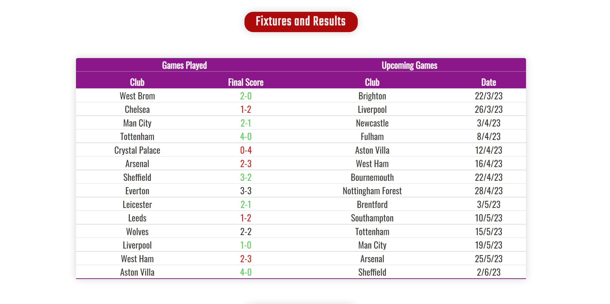

As the user hovers their cursor over the table, however, I have added a highlight property to both the columns and rows of each section within my table. The reason as to why I have decided to implement this feature is to make it easier for users to focus on whichever section they are currently looking at and placing their mouse over. The image displayed below shows what my table looks like once a certain column and row is hovered over:

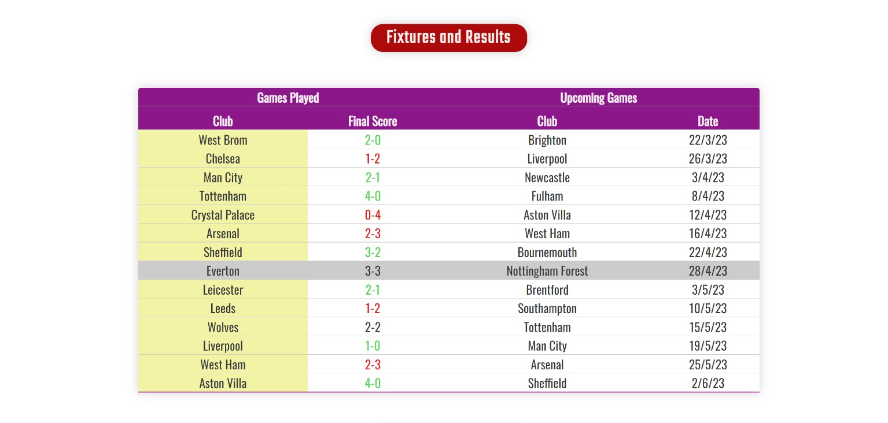

### **Player Focus**
This is a section dedicated to one player from Manchester United. This includes a brief introduction of the chosen player as well as their playing career history such as the previous clubs that they have played for. Any other important milestones that they may have achieved throughout their career so far such as their debuts, transfers and international appearances have also been highlighted. The reason why I have decided to include this section is to give the user a sense of connection to the club through it’s most exciting and fan favorite players. It also provides additional knowledge and background of the chosen player including details which the user may not have been awware of previously. By focusing on one player, it attracts and retains their attention and engagement in the site, especially if it's a player which the user is very interested in or their personal favorite of the club.

I have decided to include the image of my chosen player (Antony) in an oval format in order to make it seem more presentable and appealing to the user. Once they hover over this image, I have included a zoom animation in order to make this image seem more interactive and responsive to the user's actions. This image can be displayed below:

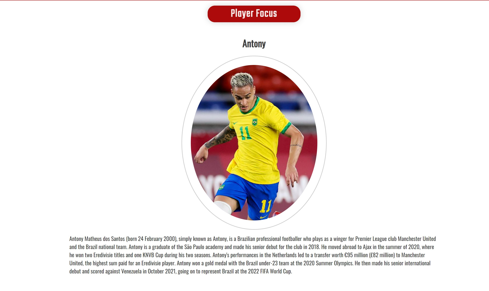

### **Contact**
The Contact section contains a form where the user enters their personal details such as their name and email address if they wish to get in touch with the provider. The structure of the form that I have decided to go with is a vertical format, where the user must enter their first name, last name, a suitable email address and an additional message that they may wish to convey regarding the website. The reason why I have decided to go with this format is beacause it is clear and easy for users to understand and enter their correct details. It is also quick to fill out and complete, which may encourage users to engage with the form as opposed to a form which requires many details and is more time consuming. My form that I have built for my website can be seen below:

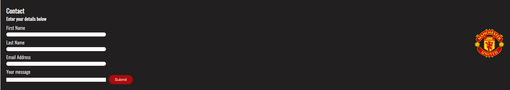

Once the user has successfully entered all of their correct details and click the approporiately styled submit button, they are redirected to a form submission page which simply thanks them for taking the time to fill out the form and that they will recieve a response shortly. Below that message, I have included a link in the form of the club's logo which will take the user back to my website. This page can be seen below:

### **Footer**
The footer of my website contains social media icons that redirects the user to their respective site such as Facebook or Twitter. These icons are suitable styled with an appropriate size and colour in order to match the overall style and layout of my website. They are also displayed on a red background that is synonymous and consistent with the rest of my site. This can be seen below:

[Back to top](#table-of-contents)

## Technologies Used

### Languages
*	HTML
*	CSS
### Libraries and Framework
*	Google Fonts
*	Font Awesome library
### Tools
*	Gitpod
*	W3C HTML Validation Service
*	W3C CSS Validation Service
*	Font Awesome library
*	Google Fonts

[Back to top](#table-of-contents)

## Testing

I am very proud of my website and feel that it has achieved all of the goals and objectives laid out at the very beginning of this project. It has a visually and aesthetically appealing layout and structure, and maintains that structure on different devices. Each section displayed within my site are spaced out appropriately so that it is clear to the user which part of my website they are currently in. My navigational bar works very well and has a fixed psition at the top of my page as the user scrolls down through the different sections on desktops. I am pleased with how my navigation slide works on smaller devices, as it is both easy to use and appropriately styled to match the layout of the rest of my website. Each time the user selects a link, they are navigated to the correct section in a smooth way in order to seem easier on the eye and not make it seem too jarring and abrupt.   

I did, of course, encounter some issues during the building of my website, such as:

* I made, I am told a common mistake of building my website to be desktop-friendly first rather than mobile. This made the process a lot more unnessasarily difficult. The reason for this is because it is a lot harder to compress a website and all of it's images rather than to expand them. As such, I had to spend a lot of time and effort making sure it looked presentable and professional on mobile devices. The navigational bar was a big problem as when I decreased the size of my screen, it would become all jumbled and impossible to read. This is why I decided to go with the hamburger style bar, which I believe works well

* Making the navigational bar fixed was also a little bit of an issue, as I was told by my mentor not to rely too heavily on float properties (rightfully so) and instead use flesbox instead. It took me a little while to learn the virtues and simplicity of flexbox, but once I did, I found positioning different elements within my website to be far more easy and less hassle in general.  

* My hero image banner displayed at the top of the website was also an issue, as my chosen image had a text section which would only display on smaller screens but not on desktops. I realised the only way round this was to crop the image and only save a particular section so that users could see the same image regaredless of the device they were viewing it on. 

* The table that I decided to include in my Fixtures section also had it's share of issues that I eventually overcame. I first had to come up with a way to display all of the data in a clear and presentable way. This is why I decided to use indented columns. Next, I needed to find a way for each row AND column to be highlighted depending on where the user hovered over. I used a simple hover pseudo class as well as z-index to make sure the correct row and column was highlighted. I then decided it looked better if the columns were highlighted one colour, and rows another to give it some form of seperation.

* When it came to my player image, it was not too much of an issue except when trying to make it more responsive for smaller devices. I realised that as I made my screen smaller, my image would have irregular positioning and would cause my banner to move to the left, leaving behind a huge blank space on the right. I managed to fix this however, after adjusting it's width and height properties as well as it's padding on either side, which seemed to be causing the issue.

HTML validator [results](./docs/images/html-validator.jpg)

CSS validator [results](./docs/images/css-validator.jpg)

[Back to top](#table-of-contents)

## Deployment

Following writing the code then commiting and pushing to GitHub, this project was deployed using GitHub by the following steps.

* Navigate to the repository on github and click 'Settings'.
* Then select 'Pages' on the side navigation.
* Select the 'None' dropdown, and then click 'master'.
* Click on the 'Save' button.
* The website is now live on https://shaf8808.github.io/manchester-united/
* If any changes are required, they can be done, commited and pushed to GitHub and the changes will be updated.

## Credits

For code help:

* [Simen Daehlin](https://github.com/Eventyret)
* Code Institute tutoring

For content and style inspiration

* [Antony Wikipedia page](https://en.wikipedia.org/wiki/Antony_(footballer,_born_2000)) 
* [Manchester United website](https://www.manutd.com/en)

[Back to top](#table-of-contents)

